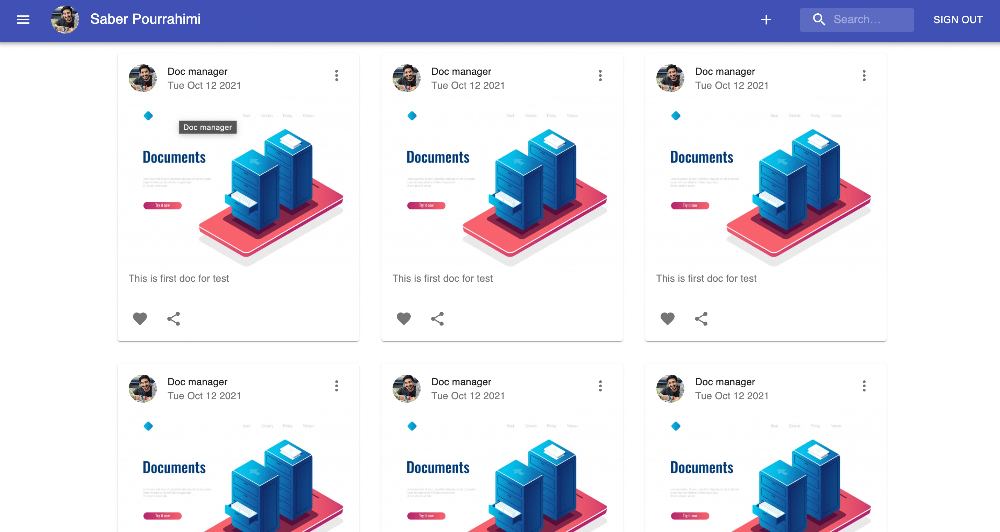

# Docs Manager
Simple minimal web app to write and manage your docs.

## Web development 

Docs is an app that attempts to use the latest cutting edge libraries and tools. As a summary:

 * Entirely written in [JavaScript](https://www.javascript.com/).
 * UI completely written in [Material-Ui](https://mui.com/).
 * Uses [React](https://reactjs.org/) throughout.
 * Uses [Firebase](https://firebase.google.com/) for Database, Storage and Authentication.
 * Uses many of the Architecture Components, including: Hooks, Lifecycle, Navigation.
 * Uses [Axios](https://axios-http.com/) for HTTP request.
 * Uses Clean architecture with modular and clean structure

 ## Screenshot

 ## Web App

 [Docs](https://spr021.github.io/Docs/)
